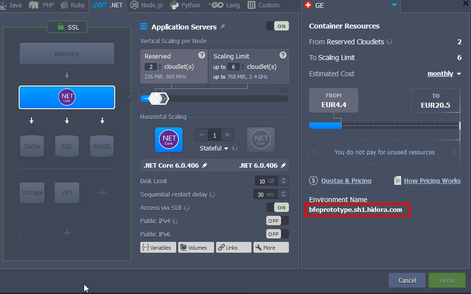

# bfe.energiedashboard.apicollection.app

## Scope

This repository contains 
A simple WEBAPI .NET 6 solution to access public csv-files from opendata.swiss - energiedashboard and present them as api for further usage by applications.

## Set-up

This Service relies on the availablity of given csv-files on opendata.swiss.
## How to run

You can either start the solution from Visual Studio, or run it without the debugger by opening a Terminal.

```

## Deployment

The app is deployed on [Hidora](https://hidora.io/), a swiss host that utilizes the [Jelastic Platform](https://jelastic.com/). It has some quirks and necessary adjustments to the configuration of the application:

- Deployment
  - The jelastic .NET environment uses the dotnet run command to build and execute applications. This means we need to deploy source code, not compiled/published artefacts. More on this in section [Creating a release package](#creating-a-release-package)
- Environment
  - Due to the host using the `dotnet run` command, the application runs in development mode. This could be changed with switches, but Blazor server deals with static assets differently in release builds, so this is not a straightforward option. Therefore, the app is run in Development mode on Hidora.
- launchSettings.json
  - The app needs to run on a specific port to be picked up by the host. To support this, the following section was added to the `launchSettings.json` file:
    ```
    "Hidora": {
        "commandName": "Project",
        "dotnetRunMessages": true,
        "launchBrowser": true,
        "applicationUrl": "http://*:5265",
        "environmentVariables": {
            "ASPNETCORE_ENVIRONMENT": "Development"
        }
    }
    ```
- appsettings.json
  - We can't easily use `appsettings.Development.json`, `appsettings.Production.json` etc, as the app always runs in Development mode. If the need for this arises in the future, a workaround needs to be found.

## Hidora Configuration



The basic configuration needed is simple - we enable SSL on the top left, add a .NET Core application layer with 2 reserved cloudlets (at least 6 cloudlets / 1.5GB RAM are recommended as the scaling limit), and start the environment. If the storage is limited to 10GB, we can assure we do not incur any costs for it.

We then need to create a release package:

### Creating a release package

The release package zip should contain the source code of the app and nothing more.

The script `deployScripts/CreateReleasePackage.ps1` automates this process.

Please note that Visual Studio should be closed before running the command, as it maintains file locks on some of the files we want to delete prior to the creation of the release package.

### Setting up environment variables

Since we are using a complex deployment package, we need to indicate to the host which project it should run. This is done by setting the `RUN_OPTION` environment variable as described [in the Jelastic Docs](https://docs.jelastic.com/net-core/).

In our case, we therefore open the environment variables of our application servers:


and add the Variable `RUN_OPTION` with value:

```
--project bfe.energiedashboard/bfe.energiedashboard.csproj --launch-profile Hidora
```

This ensures that the correct project is used and that we're using the launch profile with the port needed for this environment.

### Uploading and deploying a new version

After [Creating a release package](#creating-a-release-package), we can upload it to the Deployment Manager on [https://app.hidora.com/](https://app.hidora.com/), and deploy it to our environment.

If any issues occur, check the logs:


### Optimizing infrastructure costs

Cloudlets are billed per hour, with the higher of these values determining the amount of billed cloudlets:

- average CPU usage
- peak RAM usage

Since our application mostly idles, the average CPU usage should in most cases be very low and within the scope of our reserved cloudlets. Therefore, peak memory usage will mostly determine the amount of billed cloudlets. It should therefore be cheap to set a high scaling limit, since we don't get billed for peak CPU load.

Keeping an eye on costs and experimenting with scaling is recommended.

The environment can also be manually shut down at any time, after which it will stop consuming resources and generating costs (unless the free storage allowance of 10GB was exceeded).

To further optimize cost, the environment can be configured to automatically start and stop at predetermined points in time:


:information_source: Note that this overrides manual shutdown of the environment, and does not consider Daylight Saving Time. Be careful when configuring this.
